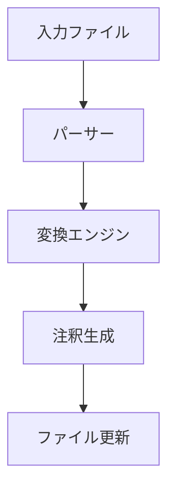

# システムパターン: cft

## アーキテクチャ概要

### モジュール構成
```
src/
├── index.ts      # エントリーポイント
├── converter.ts  # 変換ロジック
├── parser.ts     # Markdownパース
└── utils.ts      # ユーティリティ関数
```

## コアコンポーネント

### 1. エントリーポイント (index.ts)
- CLIインターフェースの提供
- 引数の検証
- 処理フローの制御
- エラーハンドリング

### 2. 変換エンジン (converter.ts)
- インライン出典から注釈への変換を担当
- 注釈IDの生成と管理
- 注釈セクションの生成

### 3. Markdownパーサー (parser.ts)
- Markdownファイルの読み込み
- インライン出典の検出
- 既存の注釈の解析

### 4. ユーティリティ (utils.ts)
- URL解析
- ドメイン抽出
- ファイル操作

## データフロー



1. **入力処理**
   - ファイルの存在確認
   - Markdown形式の検証
   - UTF-8エンコーディングの確認

2. **パース処理**
   - インライン出典のパターンマッチング
   - 既存注釈の検出
   - URLの妥当性チェック

3. **変換処理**
   - ドメインベースの注釈ID生成
   - 重複チェック
   - 注釈セクションの構築

4. **出力処理**
   - ファイルの整合性チェック
   - 注釈セクションの配置
   - ファイルの更新

## 設計パターン

### 1. シングルトン
- `CitationConverter` クラス
  - 注釈IDの一意性を保証
  - ドメインカウンターの管理

### 2. ストラテジー
- URL解析
  - 異なるURL形式に対する柔軟な対応
  - 将来的な拡張性の確保

### 3. オブザーバー
- 変換プロセスの監視
  - 進捗状況の通知
  - エラー報告

## エラーハンドリング戦略

### 1. 入力検証
```typescript
if (!file.endsWith('.md')) {
  throw new Error('Not a markdown file');
}
```

### 2. URL検証
```typescript
if (!isValidUrl(url)) {
  console.warn(`Invalid URL: ${url}`);
  // 処理は継続
}
```

### 3. ファイル操作
```typescript
try {
  await writeFile(path, content);
} catch (error) {
  throw new Error(`File write error: ${error.message}`);
}
```

## パフォーマンス最適化

### 1. メモリ使用量
- ストリーム処理の採用
- 大規模ファイルの効率的な処理

### 2. 処理速度
- 正規表現の最適化
- キャッシュの活用
- 非同期処理の活用

## テスト戦略

### 1. ユニットテスト
- URL解析
- 注釈ID生成
- パターンマッチング

### 2. 統合テスト
- ファイル変換プロセス
- エラーハンドリング
- エッジケース

### 3. パフォーマンステスト
- 大規模ファイル
- 多数の出典
- メモリ使用量
