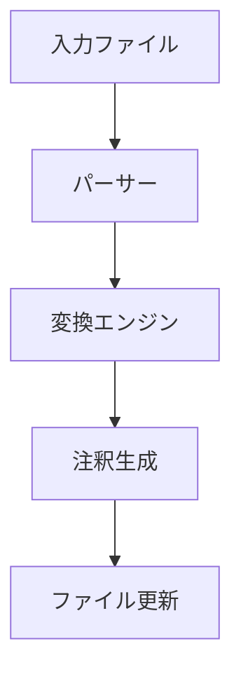
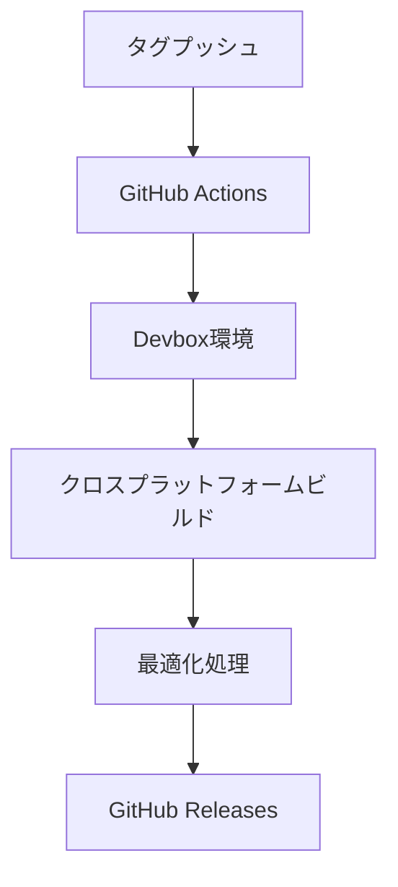

# システムパターン: cft

## アーキテクチャ概要

### モジュール構成
```
src/
├── index.ts      # エントリーポイント
├── converter.ts  # 変換ロジック
├── parser.ts     # Markdownパース
└── utils.ts      # ユーティリティ関数

dist/             # ビルド成果物
├── cft-linux            # Linux x64向けバイナリ
├── cft-linux-baseline   # 古いCPU対応Linux向けバイナリ
├── cft-macos           # macOS x64向けバイナリ
└── cft-macos-arm64     # macOS ARM64向けバイナリ
```

## コアコンポーネント

### 1. エントリーポイント (index.ts)
- CLIインターフェースの提供
- 引数の検証
- 処理フローの制御
- エラーハンドリング

### 2. 変換エンジン (converter.ts)
- インライン出典から注釈への変換を担当
- 注釈IDの生成と管理
- 注釈セクションの生成
- URL重複の検出と最適化

### 3. Markdownパーサー (parser.ts)
- Markdownファイルの読み込み
- インライン出典の検出
- 既存の注釈の解析
- テキストフラグメントの抽出

### 4. ユーティリティ (utils.ts)
- URL解析
- ドメイン抽出
- ファイル操作
- フラグメント識別子の処理

## データフロー



1. **入力処理**
   - ファイルの存在確認
   - Markdown形式の検証
   - UTF-8エンコーディングの確認

2. **パース処理**
   - インライン出典のパターンマッチング
   - 既存注釈の検出
   - URLの妥当性チェック
   - テキストフラグメントの解析

3. **変換処理**
   - ドメインベースの注釈ID生成
   - URL重複の検出と最適化
   - フラグメントテキストの抽出と整形
   - 注釈セクションの構築

4. **出力処理**
   - ファイルの整合性チェック
   - 注釈セクションの配置
   - ファイルの更新

## ビルドとデプロイメントフロー



1. **ビルドトリガー**
   - タグプッシュによる自動化
   - セマンティックバージョニング

2. **ビルド環境**
   - Devboxによる環境標準化
   - 依存関係の自動インストール

3. **バイナリ生成**
   - Linux x64（モダンCPU向け）
   - Linux x64（古いCPU向け）
   - macOS x64
   - macOS ARM64

4. **最適化処理**
   - コードの最小化（minify）
   - ソースマップの生成
   - バイトコードコンパイル

5. **配布**
   - GitHub Releasesへの自動デプロイ
   - リリースノートの自動生成

## 設計パターン

### 1. シングルトン
- `CitationConverter` クラス
  - 注釈IDの一意性を保証
  - ドメインカウンターの管理
  - URL重複の追跡

### 2. ストラテジー
- URL解析
  - 異なるURL形式に対する柔軟な対応
  - フラグメント識別子の処理
  - 将来的な拡張性の確保

### 3. オブザーバー
- 変換プロセスの監視
  - 進捗状況の通知
  - エラー報告

### 4. フライウェイト
- URL重複排除
  - 同一URLの共有
  - メモリ使用量の最適化
  - 参照の一貫性維持

## エラーハンドリング戦略

### 1. 入力検証
```typescript
if (!file.endsWith('.md')) {
  throw new Error('Not a markdown file');
}
```

### 2. URL検証
```typescript
if (!isValidUrl(url)) {
  console.warn(`Invalid URL: ${url}`);
  // 処理は継続
}
```

### 3. ファイル操作
```typescript
try {
  await writeFile(path, content);
} catch (error) {
  throw new Error(`File write error: ${error.message}`);
}
```

## パフォーマンス最適化

### 1. メモリ使用量
- ストリーム処理の採用
- 大規模ファイルの効率的な処理
- URL重複排除による最適化

### 2. 処理速度
- 正規表現の最適化
- キャッシュの活用
- 非同期処理の活用

### 3. バイナリ最適化
- コードの最小化
- バイトコードコンパイル
- ソースマップの埋め込み

### 注釈形式の設計判断

1. **フラグメント識別子の処理**
   - URLのフラグメント識別子（#:~:text=...）を引用内容として表示する理由：
     - 同一記事の異なる箇所を参照する場合の区別
     - 引用箇所の具体的な内容の明示
     - 文脈の明確化と可読性の向上
     - 参照元の特定の部分への直接的なリンク
   - フラグメントテキストの抽出と整形：
     - URLデコードの適用
     - 改行とスペースの正規化
     - HTML特殊文字のエスケープ

2. **HTMLタグの使用**
   - `<blockquote>`タグの採用理由：
     - Markdownエディタでの可視性向上
     - セマンティックなHTML構造の維持
     - CSSによるスタイリングの容易さ
     - 引用テキストの明確な区別

3. **改行の処理**
   - `<br>`タグの採用理由：
     - 1行1注釈ルールの維持
     - パース処理の簡素化
     - 引用テキスト内の改行の保持
     - 注釈セクションの構造の一貫性

4. **URL重複の最適化**
   - 同一URLの注釈の統合：
     - 重複URLの検出
     - 既存注釈の再利用
     - 参照の一貫性維持
     - メモリ使用量の削減

### 注釈の例
```markdown
[^example-1]: [Web Standards](https://example.com/standards#:~:text=Web%20standards%20define) <blockquote>Web standards define the rules and guidelines for consistent web development.</blockquote>

# 重複URLの場合、同じ注釈IDを再利用
[^example-1]
```

## テスト戦略

### 1. ユニットテスト
- URL解析
- 注釈ID生成
- パターンマッチング
- フラグメントテキスト処理
- URL重複検出

### 2. 統合テスト
- ファイル変換プロセス
- エラーハンドリング
- エッジケース
- 重複URL最適化

### 3. パフォーマンステスト
- 大規模ファイル
- 多数の出典
- メモリ使用量
- URL重複の効率
